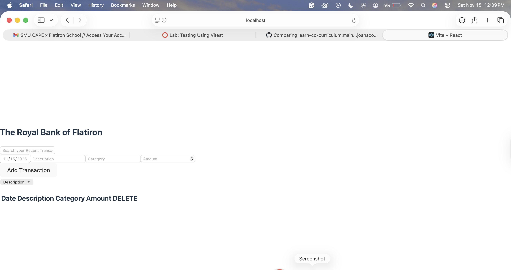

# React Testing Lab

This project is a small banking application where users can view, add, search, and sort transactions.  
For this lab, I added a full testing suite using Vites and React  testing library.
In this lab I:
- Tested that transactions load and display on startup.
- Tested that a new transaction is submitted.
- Verified that the POST request is called.
- Confirmed that the form resets after submission.
- Tested that the search input updates as the user types.
- Tested that the sort dropdown updates when the user selects an option.

 -> Below is a screenshot of the completed application:

